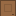
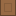
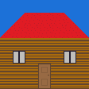
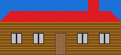

# Mappor

Mappor is a 2D-map creator. It allows you to to design and custom your project, from a little house to a whole new world.

## Hierarchy of the map

A 2D-map is made of small cases in which the player can move. Those cases are the fundamental element in order to construct the entire world.
More precisely, the visual data a case is a Tile. Then, those Tile can be combined to create Draw, wich can be use to create Map

### Tile

A Tile is just a square of pixel. It can be designed, saved and change. For example, here some Tile for a house:






A Tile is necessarily complete, and the default pixel is black.

In order to create an object with depth, you can set a pixel as a ceiling. Setted so, playerd en NPCs walk behind this pixel and are hiden.
For example, you can separate a tree feol the ground so that in the game, the player has the illusion to walk behind the tree.

### Draw

Combining different Tile together make a Draw. This is useful to create an object wich can be reused as a tree, a store, a path, or even a house:



Event if the Tile are the same, rearranging them differently make them feel differently.



The default value of a Tile for a Draw is None. It means these Tile is transparent, represented by an alternating gray pixels


### Map

A Map is a special type of Draw. It is the combination of Tile and Draw.
- The Draw can be used to rapidly generate a forest, a city and so on...
- While the Tile allows us to change the details

Moreover, a Map also contain a Ground.

### Ground

A Ground is a type of data contained by a Map. It tells to the game what type of case the map contains. By default, a case is settled to 0. The value can be:
- int between 0 and 9 : Steppable case. The number tells the floor, and the player can't directly change floor
- B : A block. The player can't go thought it
- S : Stairs or Ladder. Steppable case which link between all floor
- W : Water
- V : Void
- I : Ice or Slide. The player can't control the movement and slide to the end
- T : Teleporter
- D : Door
- N : North one-step case. This allows the player to only move one step to the north
- S : South one-step case
- W : Western one-step
- E : Eastern one-step
- X : Bridge

## Particular case of bridge
The bridgies have a special utilities. It allows you to create a supperposition of different levels : the player can go rather under the bridge or above it. But it doesnt' allows him to change floor. Considering the highest florr value, the player will be showed or hidden.

There is for now two possibilities to discuss :
- only one value is allowed, wich is easier, but breaks when two bridgies are crossing
- different value can be use to allow crossing bridges, which is on the other side more complecated to use

# How to run

You run Mappor with:

```
python3 Mappor.py
```

or install the executable and run:

```
./Mappor```

First of all, you will need to select a folder. This is in the corresponding directory you can save and load project. So that the save directory is independant to Mappor, which allows you to gain a liberty with the project you are working with.

# Dependencies

In order to work, this project need :
- Python
- ```PyQt5```
- ```matplotlib```
- ```sys```
- ```os```
- ```pathlib```
- ```imageio```
- ```numpy```

installed to work.

# Tutorial

You can find a tutorial when Mappor is runing in Help -> Tutorial

For more specific details as the coming features, you can also check our Wiki
